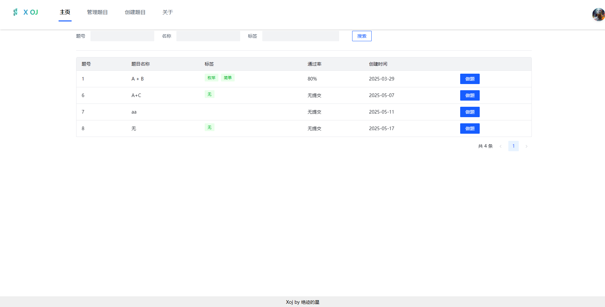
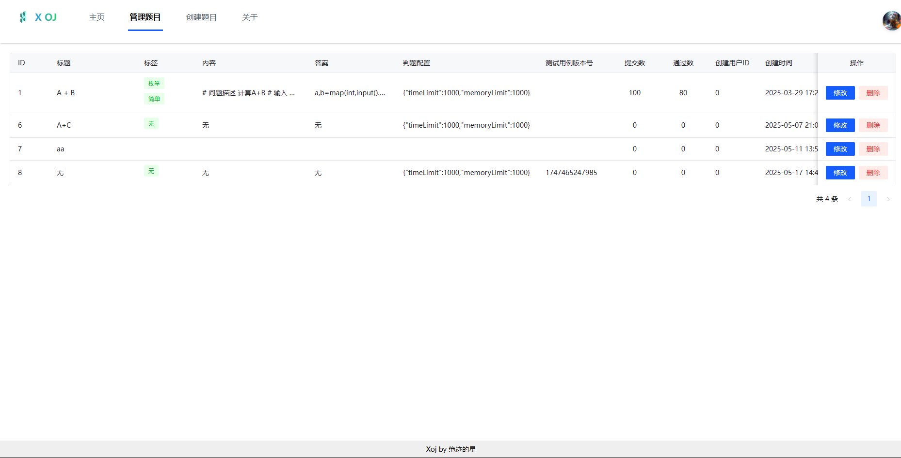
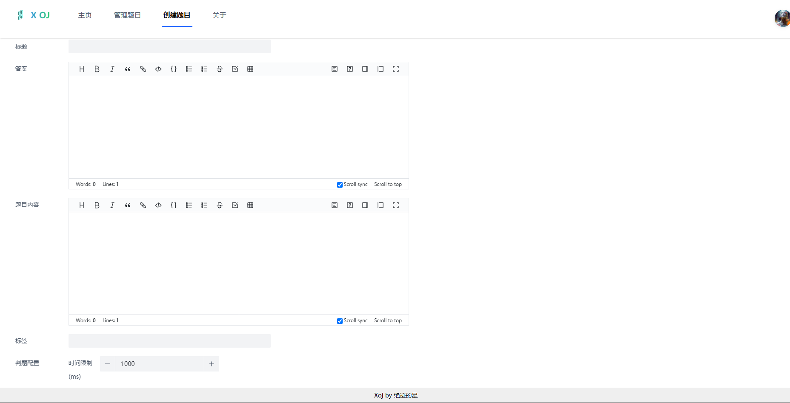
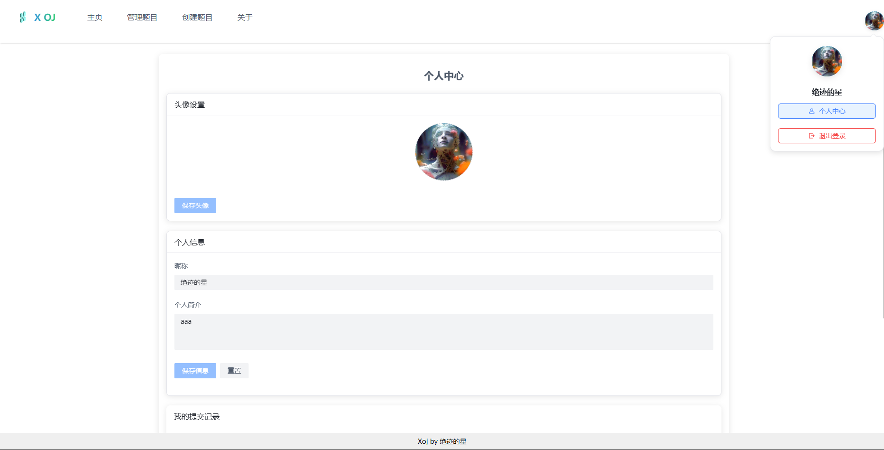

### 版本
- Spring Boot 2.7
- JDK 1.8 
- MySQL 8.0
- Elasticsearch 7.17

## 业务功能

- 用户登录、注册、更新、检索、权限管理
- 用户头像上传
- 题目增删改查
- 测试用例文件上传
- 调用远程代码沙箱进行判题

### 业务特性
 
- 全局请求响应拦截器（记录日志）
- 全局异常处理器
- 自定义错误码
- 封装通用响应类
- Swagger + Knife4j 接口文档
- 自定义权限注解 + 全局校验
- 全局跨域处理
- 长整数丢失精度解决
- 多环境配置


  
### MySQL 数据库

(1) 修改 `application.yml` 的数据库配置

```yml
spring:
  datasource:
    driver-class-name: com.mysql.cj.jdbc.Driver
    url: jdbc:mysql://localhost:3306/xoj
    username: root
    password: 123456
```

2）执行 `sql/create.sql` 中的数据库语句, 创建库表

3）启动项目, 访问 `http://localhost:8081/api/doc.html` 即可打开接口文档

### Elasticsearch 搜索引擎

(1) 修改 `application.yml` 的 Elasticsearch 配置

```yml
spring:
  elasticsearch:
    uris: http://localhost:9200
    username: root
    password: 123456
```
  
(2) 开启同步任务, 将数据库的帖子同步到 Elasticsearch

找到 schedule 目录下的 `QuestionEsSyncSchedule`, 执行全量同步  

## 前端展示




